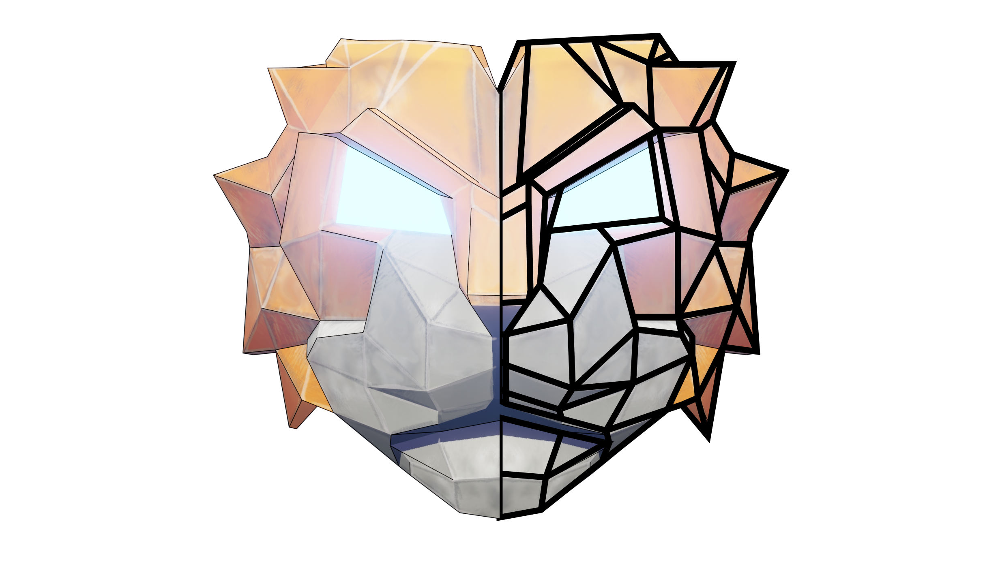

<a  name="readme-top"></a>


<!-- PROJECT LOGO -->

<br  />
<div  align="center">
<a  href="https://github.com/othneildrew/Best-README-Template">

</a>
<h3  align="center">React three NPC</h3>
<p  align="center">
<a  href="https://github.com/ssethsara/react-three-npc-sample">Sample Project</a><br/>
<a  href="https://github.com/othneildrew/Best-README-Template/issues">Report Bug</a><br/>
<a  href="https://github.com/othneildrew/Best-README-Template/issues">Request Feature</a><br/>
</p>
</div>

<!-- TABLE OF CONTENTS -->

<details>

<summary>Table of Contents</summary>

<ol>

<li>

<a  href="#about-the-project">About The Project</a>

<ul>

<li><a  href="#built-with">Built With</a></li>

</ul>

</li>

<li>

<a  href="#getting-started">Getting Started</a>

<ul>

<li><a  href="#prerequisites">Prerequisites</a></li>

<li><a  href="#installation">Installation</a></li>

</ul>

</li>

<li><a  href="#usage">Usage</a></li>

<li><a  href="#roadmap">Roadmap</a></li>

<li><a  href="#contributing">Contributing</a></li>

<li><a  href="#license">License</a></li>

<li><a  href="#contact">Contact</a></li>

<li><a  href="#acknowledgments">Acknowledgments</a></li>

</ol>

</details>

<!-- ABOUT THE PROJECT -->

## About The Project

This is a non playable character control system based on yuka.js built for react three fiber based games. You can make your NPCs roaming around he map or follow a specific target. This is open sourced under MIT License. Invite all the developers to contribute to this and build strong eco system for react three fiber game developers.

**Background (why I built this)**
"I learned about react three fiber last year by accident and self studied it to identify it's true power. I conduct my own R&D project and built web visualizers and built XR supported metaverses. My most recent project is to build a complete third person adventure game with react three fiber. While working on it I identify lack of NPC control system. This System built for my own game currently WIP. However I would love to share it everyone and see it grow with community support. also love to see more amazing r3f games."
-s.sethsara-

### Built With

This application built with react and I have used following packages.
[![React][React.js]][React-url]
**[react-three-rapier](https://github.com/pmndrs/react-three-rapier)**
**[yuka](https://github.com/Mugen87/yuka)**
**[zustand](https://github.com/pmndrs/zustand)**
**[three.js](https://github.com/mrdoob/three.js)**

<p  align="right">(<a  href="#readme-top">back to top</a>)</p>

<!-- GETTING STARTED -->

## Getting Started

###Youtube video 

[https://youtu.be/yI9lUPgPxBg](https://youtu.be/yI9lUPgPxBg)

<br/>

First create your react three fiber projects using instructions on theirs official web site
https://docs.pmnd.rs/react-three-fiber/getting-started/introduction

### Prerequisites

You will need these packages instralled as a prerequisites

- Yuka

```sh
npm i yuka
```

- React three rapier

```sh
npm i @react-three/rapier
```

- zustand

```sh
npm i zustand
```

Apart from that you will need a character controller. You can use your own character controller. Or I can recommend ecctrl which is easy and powerful character controller for r3f.
https://github.com/pmndrs/ecctrl

### Installation

_These are the steps to integrate this system to your game._

1. Install NPM package

```sh
npm i @ssethsara/react-three-npc
```

<br/>

**File Structure I used**

**Navmesh setup**

1. Create navmesh

   You can generate your navmesh using this site by uploading your 3D models.
   https://navmesh.isaacmason.com/

   and add it into your project public folder.

2. load navmesh file in your App.js

   ```js
   import { Canvas } from "@react-three/fiber";
   import "./App.css";
   import { useNavMesh } from "@ssethsara/react-three-npc";

   import Scene from "./Scene";
   import { Suspense } from "react";

   function App() {
     const actions = useNavMesh((state) => state.actions);
     return (
       <>
         <Canvas
           onCreated={() => {
             actions.loadNavMesh("./models/navmesh.glb");
           }}
         >
           <Scene />
         </Canvas>
       </>
     );
   }
   export default App;
   ```

3. Navmesh visualizer (Optional)

   create NavMeshConvex.jsx inside the component folder.

   ```js
   import { useEffect, useRef } from "react";
   import { useNavMesh } from "@ssethsara/react-three-npc";

   export function NavMeshConvex(props) {
     const ref = useRef();
     const level = useNavMesh((state) => state.level);

     useEffect(() => {
       if (ref.current) {
         useNavMesh.setState((state) => ({
           refs: {
             ...state.refs,
             level: level,
           },
         }));
       }
     }, []);

     return (
       <group {...props} dispose={null}>
         <group position={[0, -0.5, 0]}>
           <mesh material={level.material} geometry={level.geometry} />
         </group>
       </group>
     );
   }
   ```

4. use Manager from NPC system and put inside the rapier Physics tag ( add it to your main r3f application file. for me it is Scene.jsx file)

   ```js
   import { Physics } from "@react-three/rapier";
   import { Manager } from "@ssethsara/react-three-npc";
   <Physics>
     <Manager></Manager>
   </Physics>;
   ```

5. Add Navmesh NavMeshConvex.jsx compoent inside the manager to visualize the navmesh (Optional)

   ```js
   <Physics>
     <Manager>
       <group position={[0, 0, 0]} scale={1}>
         <NavMeshConvex visible={true} />
       </group>
     </Manager>
   </Physics>
   ```

6.Now you can add your navmesh Agent inside the manager with your character 3D model

```js
	import { NavMeshAgent } from "@ssethsara/react-three-npc";
	<Manager>
		<NavMeshAgent
			name={enemy.name}
			agentId={enemy.agentId}
			position={enemy.position}
			navPoints={enemy.navPoints}
			maxForce={enemy.maxForce}
			maxSpeed={enemy.maxSpeed}
			removed={enemy.removed}
			// isPlayerDetected={true} >
				<Drone  agentId={enemy.agentId}  scale={0.7}  />
		</NavMeshAgent>
	</Manager>
```

In here props used as this.

- name : string = type of the agent (currently it only support "Enemy" type)
- agentId : string = Should be any unique id to identify the agent.
- position : array = starting position of the agent.(ex : [10, 2, 20])
- navPoints : array of Vector3 = navigation points
  `navPoints: [
new  Vector3(10, 2, 10),
new  Vector3(50, 2, 60),
new  Vector3(90, 2, 30),
],`
- maxForce : number = acceleration from stop.
- maxSpeed : number = speed of travel
- removed : boolean = is agent removed from system.
- isPlayerDetected : boolean = is agent follow the player or assigned point in the map

**!!!
Make sure your enemy model is cloned using SkeletonUtils
https://threejs.org/docs/#examples/en/utils/SkeletonUtils**

for that inside your 3D model component add following SkeletonUtils configurations
install
`npm install three-stdlib`

```js
	import { SkeletonUtils } from  "three-stdlib";

	export  function  Drone(props) {
		const  group = useRef();
		const { scene, materials, animations } = useGLTF("./characters/Drone.glb");
		const { actions } = useAnimations(animations, group);
		const  clone = useMemo(() =>  SkeletonUtils.clone(scene), [scene]);
		const { nodes } = useGraph(clone);
		return (
		....
		)
	}
```

<p  align="right">(<a  href="#readme-top">back to top</a>)</p>

**Advance setup**
I created new enemy controller component called Enemies.jsx like this to handle everything in one place,

```js
import { useMemo, useState } from "react";
import { Vector3 } from "three";
import { Manager } from "@ssethsara/react-three-npc";
import { NavMeshConvex } from "./NavMeshConvex";
import { NavMeshAgent } from "@ssethsara/react-three-npc";
import { Drone } from "./Drone";

const Enemy = ({ enemy, onEnemyClick, onFireTriggers }) => (
  <NavMeshAgent
    key={enemy.agentId}
    name={enemy.name}
    agentId={enemy.agentId}
    position={enemy.position}
    navPoints={enemy.navPoints}
    maxForce={enemy.maxForce}
    maxSpeed={enemy.maxSpeed}
    removed={enemy.removed}
    // isPlayerDetected={true}
  >
    <Drone agentId={enemy.agentId} scale={0.7} />
  </NavMeshAgent>
);

export default function Enemies({ onKill }) {
  const [enemies, setEnemies] = useState([
    {
      name: "Enemy",
      agentId: "e1",
      position: [10, 2, 20],
      navPoints: [
        new Vector3(10, 2, 10),
        new Vector3(50, 2, 60),
        new Vector3(90, 2, 30),
      ],
      maxForce: 20,
      maxSpeed: 5,
      color: "red",
      removed: false,
      blastVisible: false,
    },
    {
      name: "Enemy",
      agentId: "e2",
      position: [-10, 2, -10],
      navPoints: [
        new Vector3(-10, 2, -10),
        new Vector3(50, 2, 60),
        new Vector3(-30, 2, -60),
      ],
      maxForce: 10,
      maxSpeed: 5,
      color: "blue",
      removed: false,
      blastVisible: false,
    },
  ]);

  const enemiesMemo = useMemo(() => {
    return enemies;
  }, [enemies]);

  const enemiesList = enemiesMemo.map((enemy) => (
    <Enemy key={enemy.agentId} enemy={enemy} />
  ));

  return (
    <>
      <Manager key="manager">
        {enemiesList}
        <group position={[0, 0, 0]} scale={1}>
          <NavMeshConvex visible={true} />
        </group>
      </Manager>
    </>
  );
}
```

<!-- USAGE EXAMPLES -->

## Usage

Use this space to show useful examples of how a project can be used. Additional screenshots, code examples and demos work well in this space. You may also link to more resources.

_For more examples, please refer to the [Documentation](https://example.com)_

<p  align="right">(<a  href="#readme-top">back to top</a>)</p>

<!-- ROADMAP -->

## Roadmap

- [x] Build functional NPC system for r3f.

- [x] Prepare open source project on github

- [ ] Give more controls over the system.

- [ ] Bug fix

See the [open issues](https://github.com/othneildrew/Best-README-Template/issues) for a full list of proposed features (and known issues).

<p  align="right">(<a  href="#readme-top">back to top</a>)</p>

<!-- CONTRIBUTING -->

## Contributing

Contributions are what make the open source community such an amazing place to learn, inspire, and create. Any contributions you make are **greatly appreciated**.

If you have a suggestion that would make this better, please fork the repo and create a pull request. You can also simply open an issue with the tag "enhancement".

Don't forget to give the project a star! Thanks again!

1. Fork the Project

2. Create your Feature Branch (`git checkout -b feature/AmazingFeature`)

3. Commit your Changes (`git commit -m 'Add some AmazingFeature'`)

4. Push to the Branch (`git push origin feature/AmazingFeature`)

5. Open a Pull Request

<p  align="right">(<a  href="#readme-top">back to top</a>)</p>

<!-- LICENSE -->

## License

Distributed under the MIT License. See `LICENSE.txt` for more information.

<p  align="right">(<a  href="#readme-top">back to top</a>)</p>

<!-- CONTACT -->

## Contact

Supun Sethsara - [@twitter/x](https://twitter.com/Sethsara)

LinkedIn - [Supun Sethsara](https://linkedin.com/in/supun-sethsara)

Project Link: [https://github.com/ssethsara/react-three-npc](https://github.com/ssethsara/react-three-npc)

<p  align="right">(<a  href="#readme-top">back to top</a>)</p>

<!-- ACKNOWLEDGMENTS -->

## Acknowledgments

Inspired from these works.
https://codesandbox.io/p/sandbox/ic4fg?file=%2Fsrc%2Findex.js
https://github.com/isaac-mason/recast-navigation-js

r3f tutorials useful for me
https://www.youtube.com/c/wawasensei

Yuka Tutorial:
https://www.youtube.com/playlist?list=PLjcjAqAnHd1ENaMQ_xee0PQ2vVbUfnz2N

ecctrl
https://github.com/pmndrs/ecctrl
